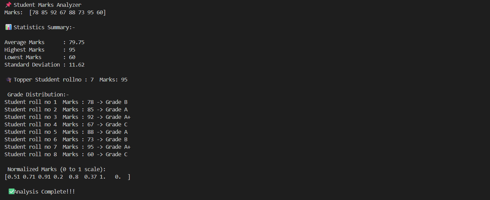

# NumPy Marks Analyzer 📊

A beginner-friendly mini project using **Python + NumPy**.

## Features
- Calculates average, highest, and lowest marks
- Finds topper using `argmax`
- Assigns grades using NumPy logic
- Normalizes marks between 0 and 1

## Tech Used
- Python
- NumPy

## Sample Output




## How to Run

```bash
python marks_analyzer.py
```